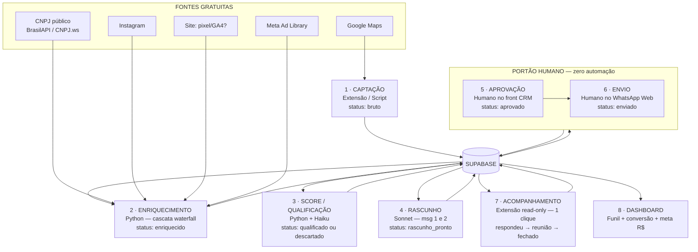

# GARIMPO — Mapa do Projeto
### CRM de prospecção assistida por IA, barato e com humano no loop

> **Codinome:** Garimpo (placeholder — você "garimpa" leads). Troque quando quiser.
> **Para quem:** seu amigo gestor de tráfego (usuário). **Quem constrói/mantém:** você.
> **Decisão fundadora:** a IA *encontra, enriquece, pontua e rascunha*. O humano *aprova e envia*. Nunca o contrário.

---

## 1. O que é, em uma frase

Um banco de contatos próprio (Supabase) + um painel de funil (front CRM) + uma esteira de scripts Python que garimpa e qualifica leads sozinha + uma extensão read-only que deixa o humano atualizar o status do lead em 1 clique sobre o WhatsApp Web. Tudo barato, sem ferramenta paga onde script resolve, e sem nenhum envio automático.

---

## 2. Princípios inegociáveis (os critérios que governam tudo)

Toda decisão de build é checada contra estes cinco. Se quebra um, está errado.

1. **Humano no loop sempre.** Nenhuma linha do sistema envia mensagem sozinha. A IA produz rascunho; o humano aprova e dispara manualmente. (É o que protege de ban de WhatsApp, de queda de deliverabilidade e de LGPD — os três te levam ao mesmo lugar.)
2. **Barato por padrão.** Python e fonte gratuita primeiro. Ferramenta paga só entra quando ela ganha o lugar dela com clareza. Meta hoje: rodar por menos de ~R$30/mês.
3. **Sinal e proveniência são cidadãos de primeira classe.** O banco guarda *qual fonte achou o quê* e *por que o lead foi qualificado*. Isso é o que diferencia o Garimpo de "uma planilha bonita".
4. **LGPD desde o schema.** Campo de opt-out existe desde a primeira tabela. Pediu pra sair, sai na hora.
5. **Mantível por você.** Stack que você consegue subir de novo às 3h da manhã quando quebrar. Sem mágica que só funciona uma vez.

---

## 3. O fluxo completo (o projeto rodando)



**Leitura em uma frase:** as fontes alimentam a captação → o Supabase é a espinha por onde tudo passa → Python enriquece e pontua → a IA rascunha → **o humano aprova e envia** → a extensão atualiza o status conforme o lead responde → o dashboard mede.

---

## 4. As tecnologias — o que cada uma faz

| Peça | Tecnologia | Papel | Por quê esta |
|---|---|---|---|
| **Banco** | **Supabase** (Postgres) | Fonte da verdade. Guarda leads, status, proveniência, log de mudanças. Dá API REST e Realtime automáticos, Auth e Row Level Security de graça. | Postgres de verdade resolve os 3 furos do Sheets: escrita concorrente, validação/integridade e relação. Free tier aguenta tranquilo. |
| **Esteira** | **Python** (scripts) | A cascata de enriquecimento, o score e a geração de rascunho. Lê leads num status, processa, escreve no próximo status. | Grátis, controle total, é onde o barateamento acontece. Roda agendado via **GitHub Actions (cron gratuito)** — sem precisar de VPS no começo. |
| **Painel** | **Next.js + shadcn/ui** | O front CRM: ver, filtrar, editar leads; mudar status; aprovar rascunho; ver o funil. | Você já domina shadcn (design system do Oderço). Serve de peça de portfólio sênior. Para velocidade, a Fase 1 entrega uma versão mínima (tabela + status) pra tirar o amigo do Sheets já. |
| **Extensão** | **Chrome Extension (Manifest V3)** read-only | Sobre o WhatsApp Web: lê qual conversa está aberta, casa com o lead no banco, mostra card lateral com botões de status contextuais. **Nunca envia, nunca injeta texto.** | Mata o context-switch (sair do WA, achar o lead, mudar status). Risco de ban desprezível porque só lê — o WhatsApp fiscaliza envio, não leitura. |
| **Cérebro (IA)** | **Camada LLM** (ver seção 5) | Enriquece campo solto, pontua contra o ICP, escreve a copy personalizada. Roda *dentro* da esteira Python, por lead. **Default: Gemini free tier (R$0).** | É o que torna a qualificação e o rascunho automáticos — de graça no nosso volume. |

**Particularidades técnicas a não esquecer:**
- **Hospedar a esteira:** comece com **GitHub Actions** (cron grátis roda os scripts Python em horário). Só migra pra VPS (~R$20/mês) se precisar de algo sempre-ligado.
- **A extensão escreve no Supabase** via client com a *anon key* + RLS travando o acesso. Ela fala com o nosso banco, não com o WhatsApp.
- **O ponto mais difícil de engenharia** é a extensão casar a conversa aberta com o lead certo: o WhatsApp Web nem sempre expõe o número cru no DOM. Plano: casar por número quando disponível, por nome exibido como fallback, e ter o modo "colar número manual" como rede de segurança. (Território de Opus.)

#### Boas práticas de descoberta (Maps) — otimizando o fluxo atual

O fluxo que seu amigo já usa (LLM busca no Maps → devolve IG/site/anúncio/nota → cérebro gera a mensagem) **está certo na lógica** — é a nossa cascata feita à mão. O Garimpo automatiza a orquestração e adiciona o que falta. As boas práticas que a pesquisa confirmou:

- **O teto de 120 resultados.** O Google Maps mostra no máximo ~120 lugares por busca, não importa quantos existam. Buscar "pizzaria em Maringá" de uma vez **esconde a maioria dos leads**. Solução: quebrar a busca em **grade** (por bairro/região ou coordenadas) e varrer bloco a bloco. Em Maringá é leve, mas garante cobertura.
- **A API oficial nunca dá IG nem e-mail.** O Places API entrega nome/nota/telefone/horário, mas **social e e-mail não existem no feed dele** — vêm só do enriquecimento. Isso *valida nossa cascata*: Maps acha o negócio, as outras fontes acham o resto.
- **Valide o conteúdo, não o status HTTP.** Maps às vezes devolve dado incompleto que *parece* válido (falha silenciosa). O script tem que checar se o campo veio mesmo, não só se a resposta foi 200.
- **Dado decai 3–5% ao mês.** Telefone muda, negócio fecha. Re-enriquecer leads antigos periodicamente faz parte da rotina.
- **Seu ICP é literalmente o ouro.** A pesquisa repete: negócio sem presença digital é mina de ouro pra quem vende design/marketing/SEO. Sinal de descuido digital = lead quente. Confirma o filtro que vocês já tinham.

---

## 5. Os modelos de IA — dois papéis diferentes

Aqui mora a sacada que você quase juntou: os modelos têm **dois usos distintos** no projeto. Separar os dois é o que evita gastar Opus onde Haiku resolve, e vice-versa.

### Papel A — Modelos como DESENVOLVEDORES (no momento de construir)

São os que escrevem o código do Garimpo.

| Modelo | Constrói o quê | Lógica |
|---|---|---|
| **Claude Opus 4.8** | A arquitetura, o schema do Supabase, a máquina de estados, as policies de RLS (segurança), a lógica de score, e o miolo difícil da extensão (ler o DOM do WhatsApp). Tudo onde errar é caro ou exige julgamento de design. | É o arquiteto. Pensa a estrutura e os trechos onde um erro silencioso custa caro. |
| **Codex (agente de código da OpenAI)** | Execução de tickets bem especificados: o CRUD do front Next.js, boilerplate, refatorações, testes. Aquilo que o Opus já desenhou e só precisa ser martelado com precisão. | É o executor. Brilha quando o escopo já está claro. |
| **Sonnet / Haiku** (utilitário) | Scripts pequenos e descartáveis, transformações pontuais, um parser rápido. | Mão de obra leve pra coisa pequena, sem acionar o arquiteto. |

> Mental model de build: **Opus e Codex constroem a estrutura; Sonnet/Haiku ajudam no miúdo.** Você arquiteta com Opus, manda o Codex executar o que está especificado, e usa Sonnet/Haiku pra utilitário. Tudo isso via os **CLIs/assinaturas que você já paga** (Claude Code no Max, Codex CLI, Gemini CLI) — custo marginal R$0, que é exatamente pra isso que eles servem.

### Papel B — Modelos como RUNTIME (rodando *dentro* do produto, por lead)

São os que trabalham toda vez que um lead passa pela esteira. O critério aqui é **custo × julgamento × precisa rodar sem máquina ligada?**. E a boa notícia: no nosso volume (prospecção diária = dezenas de leads/dia, não milhares), dá pra rodar **de graça**.

**Default recomendado: Gemini API free tier.** O tier grátis do Gemini (Flash e Flash-Lite) dá ~1.500 requisições/dia, sem cartão e sem expiração — muito acima do que a prospecção diária consome. E é **API de verdade** (não CLI), então integra limpo no Python e roda no GitHub Actions **sem máquina ligada**.

| Tarefa no runtime | Modelo | Por quê |
|---|---|---|
| Classificar / extrair campo / pontuar contra o ICP (volume, baixo julgamento) | **Gemini Flash-Lite** (free) | O mais generoso e rápido do tier grátis. Custo R$0. |
| Escrever a copy (msg 1 e 2), diagnóstico (julgamento, ainda em escala) | **Gemini Flash** (free) → ou **Sonnet** (pago) se quiser copy mais lapidada | Flash já entrega; Sonnet é o upgrade se a copy precisar de mais polimento. |
| Investigação profunda de um lead de alto valor (sob demanda, nunca em lote) | **Opus** | Caro por lead; reservado pro lead que vale o gasto. |

**A pegadinha do free tier do Gemini:** os prompts do tier grátis **podem ser usados pra treinar o modelo do Google** (o pago e o Vertex não). Pra dado público de negócio (nome, nota, IG), é baixo risco. Se incomodar, o caminho é Haiku/Sonnet pago (centavos por lead) — aí o dado não vai pra treino.

> Mental model de runtime: **Gemini Flash-Lite é o operário grátis (volume), Gemini Flash/Sonnet é o copywriter (qualidade), Opus é o consultor (sob demanda).**

**Sobre usar os CLIs (Claude Code / Codex / Gemini CLI) no runtime:** dá, mas não compensa. CLI é ferramenta de *codar* — agêntica, roda local (máquina tem que estar ligada), presa à cota da assinatura, saída mais bagunçada de parsear. Forçar ela a "classificar 20 leads num loop agendado" reintroduz o "máquina ligada" que a gente quer evitar e fica mais frágil. O free tier do Gemini resolve o mesmo problema (R$0) sem nenhum desses defeitos. **Use os CLIs onde eles brilham: no Papel A, construindo.**

---

## 6. A máquina de estados do lead

Esta é a peça que dita **tudo** — o schema do banco e os botões contextuais da extensão saem daqui. Cada status só pode ir pra um conjunto pequeno de próximos.

```
bruto
  └─► enriquecido
        └─► qualificado ──► descartado (saída)
              └─► rascunho_pronto
                    └─► aprovado            [humano]
                          └─► enviado       [humano]
                                ├─► sem_resposta ──► (follow-up) ──► enviado
                                └─► respondeu
                                      ├─► sem_interesse (saída)
                                      └─► interessado
                                            └─► reuniao
                                                  └─► proposta
                                                        ├─► fechado (saída ✓)
                                                        └─► perdido (saída)
```

**Os botões da extensão são contextuais ao status atual** — nunca 11 botões, só os 3-4 próximos passos prováveis:
- está `enviado` → `[Respondeu] [Sem resposta] [Número errado]`
- está `respondeu` → `[Interessado] [Agendou reunião] [Sem interesse]`
- está `interessado` → `[Reunião] [Proposta] [Perdido]`

Cada clique grava no Supabase e carimba a data/hora numa tabela de histórico (auditoria do funil).

---

## 7. Ordem de construção — o que criamos primeiro

A ordem segue um princípio: **tirar o amigo do Sheets cedo** (entregar valor já) e só depois empilhar automação.

| Fase | Entrega | Resultado |
|---|---|---|
| **0 · Fundação** | Schema do Supabase + máquina de estados + tabelas de proveniência e histórico + RLS. | A base que todo o resto depende. *(Opus)* |
| **1 · Sair do Sheets** | Supabase populado + front mínimo: tabela de leads, filtro, editar, mudar status na mão. | O amigo já usa, já larga o Sheets, já vê valor. *(Opus arquiteta, Codex executa o CRUD)* |
| **2 · Esteira de enriquecimento** | Scripts Python da cascata: Maps → CNPJ → Instagram → site → Ad Library, com proveniência e match rate. Roda no GitHub Actions. | Leads entram crus e saem enriquecidos sozinhos. *(Opus desenha a cascata, Codex/Sonnet implementam fontes)* |
| **3 · Score + rascunho** | Integração Haiku (score contra ICP) + Sonnet (copy msg 1 e 2). Status andam sozinhos até `rascunho_pronto`. | A IA qualifica e escreve; chega pronto pro humano aprovar. |
| **4 · Extensão read-only** | A extensão Chrome: lê conversa aberta, casa com lead, botões de status contextuais. | Status em 1 clique sobre o WhatsApp, sem trocar de aba. *(Opus no miolo do DOM)* |
| **5 · Dashboard + polimento** | Funil, conversão, progresso pra meta de receita. Refino de UI do front. | A camada que mede e a vitrine de portfólio. |

---

## 8. Critérios de aceite por peça

Cada peça só está "pronta" quando atende:

**Schema / banco**
- Suporta proveniência (qual fonte achou cada campo) e match rate.
- Representa a máquina de estados inteira, com tabela de histórico de mudança de status.
- Deduplica por CNPJ e/ou telefone (não cria lead repetido).
- Tem campo de opt-out LGPD desde já.
- RLS travando: só o dono enxerga os dados.

**Front CRM**
- O amigo vê, filtra e edita lead e muda status **sem tocar em código**.
- Carrega rápido; usável no dia a dia.
- Aprovar rascunho é um fluxo claro (ver → editar → aprovar).

**Esteira de enriquecimento**
- ≥80% dos leads saem com telefone; meta de nome do dono via CNPJ.
- Custo por lead perto de zero.
- **Idempotente:** rodar de novo não re-processa nem duplica.
- Campo ausente vira **campo vazio, não erro** (ausência de site é sinal, não bug).
- Respeita rate limit das fontes (lotes + delays).

**Score / qualificação**
- Alinhado ao ICP: nota 4,3+, 80–800 avaliações, sinais de descuido digital, "já anuncia?".
- Score **explicável** (por que esse lead pontuou X).

**Rascunho**
- Produz o fluxo de 2 mensagens (roteamento → pitch).
- **Nunca envia.** Sempre editável antes de aprovar.

**Extensão**
- **Read-only de verdade:** não envia, não injeta, não raspa contato em massa.
- Casa a conversa aberta com o lead; degrada pro modo "colar número" quando não casa.
- Botões contextuais ao status; grava no Supabase.

**Sistema inteiro**
- Zero envio automático. Conforme LGPD. Roda por menos de ~R$30/mês. Você consegue manter.

---

## 9. Riscos e mitigações

| Risco | Mitigação |
|---|---|
| Ban de WhatsApp | Extensão **só lê**; envio é 100% manual pelo humano. |
| Deliverabilidade / pattern de IA | Humano aprova e ajusta cada mensagem; nada sai em massa idêntico. |
| LGPD (cold B2B) | Opt-out no schema; remoção imediata a pedido; base de contato pública. |
| Esteira raspando rápido demais | Lotes de 20–30 + delays; GitHub Actions agendado, não em rajada. |
| Custo de IA fugir | Haiku por padrão; Sonnet só na copy; Opus só sob demanda. |
| Você virar suporte vitalício | Stack mantível + este mapa documentado. Se virar produto, definir limite/cobrança. |
| Extensão não casar o lead | Fallback de número manual garante que sempre funciona, mesmo sem o auto-match. |

---

## 10. Custo estimado (mensal)

- **Supabase:** R$0 (free tier).
- **GitHub Actions:** R$0 (cron grátis).
- **Front (Vercel):** R$0 (hobby) — ou domínio próprio se quiser.
- **IA no runtime:** **R$0** via Gemini free tier (Flash/Flash-Lite, ~1.500 req/dia). Só vira centavos/mês se optar por Haiku/Sonnet pago — pra fugir do treino-em-dados ou melhorar a copy.
- **IA no build:** **R$0 marginal** — via os CLIs que você já assina (Claude Code/Max, Codex, Gemini CLI).
- **Fontes de dado:** R$0 (Maps via extensão, CNPJ público, Instagram, Ad Library).
- **Apollo:** R$0 — **cortado.** Só reativa se for atrás do motor B2B estruturado.

**Total realista: < R$30/mês.**

---

## 11. Próximo passo

Construir a **Fase 0 (Fundação)**: modelar o schema do Supabase já com proveniência, histórico e a máquina de estados embutida. Ela dita o banco *e* a extensão, então é o tijolo que sustenta o resto.
